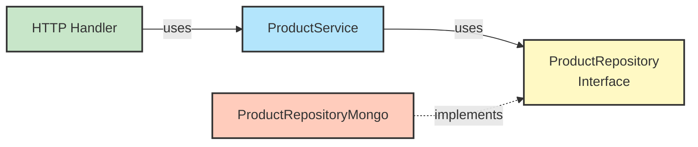
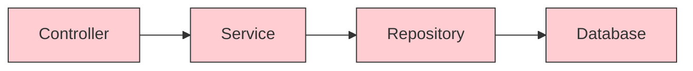
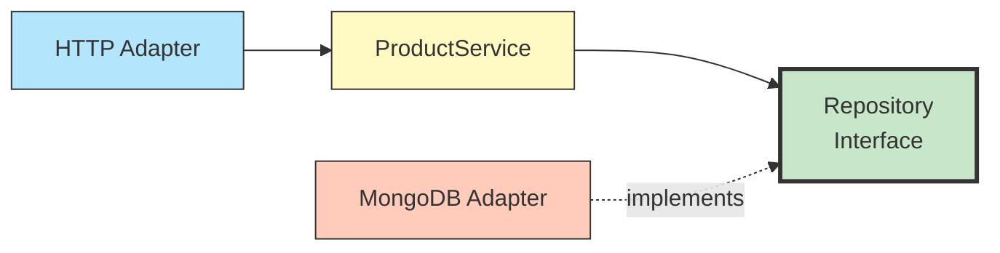

# Hexagonal Architecture - Detailed Explanation

## What is Hexagonal Architecture?

Hexagonal Architecture, also known as **Ports and Adapters** architecture, was introduced by Alistair Cockburn. The main goal is to create loosely coupled application components that can be easily connected to their software environment through ports and adapters.

## Core Concepts

### 1. The Hexagon (Application Core)
The hexagon represents the application core containing:
- **Domain Entities**: Pure business objects (Product)
- **Business Logic**: Rules and operations
- **Ports (Interfaces)**: Boundaries of the application

### 2. Ports
Ports are interfaces that define how the application can be used or how it uses external services.

**Primary Ports (Driving/Inbound)**:
- Interfaces that allow external actors to interact with the application
- Example: `ProductService` interface used by HTTP handlers

**Secondary Ports (Driven/Outbound)**:
- Interfaces the application needs to interact with external services
- Example: `ProductRepository` interface for data persistence

### 3. Adapters
Adapters are implementations of ports that connect the application to the outside world.

**Primary Adapters (Driving/Inbound)**:
- Drive the application (HTTP REST API, CLI, GraphQL)
- Example: `ProductHandler` - REST API adapter using Boost.Beast

**Secondary Adapters (Driven/Outbound)**:
- Driven by the application (Database, Message Queue, External APIs)
- Example: `ProductRepositoryMongo` - MongoDB adapter

## In Our Product Catalog Microservice

```mermaid
graph LR
    subgraph UserSide["👤 USER SIDE<br/><br/>What we provide to<br/>the end user"]
        Actor((User))
        RestAPI[REST API<br/>Handler<br/><b>ProductHandler</b>]
        TestAgent[Test<br/>Agent]
    end
    
    subgraph Hexagon["🎯 BUSINESS DOMAIN"]
        subgraph Ports[""]
            ServicePort[🔵 Primary Port<br/><i>&lt;interface&gt;</i><br/><b>ProductService</b>]
            RepoPort[🔵 Secondary Port<br/><i>&lt;interface&gt;</i><br/><b>ProductRepository</b>]
        end
        
        subgraph BusinessLogic["💼 Business Logic"]
            Domain[<b>Product Entity</b><br/>• Validation<br/>• Business Rules<br/>• Domain Logic]
        end
        
        ServicePort -.->|uses| BusinessLogic
        BusinessLogic -.->|needs| RepoPort
    end
    
    subgraph ServerSide["⚙️ SERVER SIDE<br/><br/>What we depend on<br/>DB, External Services"]
        MongoDB[(MongoDB<br/>Database)]
        MongoAdapter[Database<br/>Adapter<br/><b>ProductRepositoryMongo</b>]
        MockAdapter[Mock<br/>Adapter<br/><i>for testing</i>]
    end
    
    Actor -->|HTTP Request| RestAPI
    TestAgent -.->|test calls| ServicePort
    RestAPI -->|depends on| ServicePort
    
    RepoPort <-.->|implements| MongoAdapter
    RepoPort <-.->|implements| MockAdapter
    MongoAdapter -->|persists to| MongoDB
    
    style Hexagon fill:#ffe6e6,stroke:#333,stroke-width:3px
    style Ports fill:#e3f2fd,stroke:#1976d2,stroke-width:2px
    style BusinessLogic fill:#fff9c4,stroke:#f57c00,stroke-width:2px
    style ServicePort fill:#90caf9,stroke:#1565c0,stroke-width:2px
    style RepoPort fill:#90caf9,stroke:#1565c0,stroke-width:2px
    
    style RestAPI fill:#a5d6a7,stroke:#2e7d32,stroke-width:2px
    style TestAgent fill:#a5d6a7,stroke:#2e7d32,stroke-width:2px
    
    style MongoAdapter fill:#c5e1a5,stroke:#558b2f,stroke-width:2px
    style MockAdapter fill:#c5e1a5,stroke:#558b2f,stroke-width:2px
    
    style UserSide fill:#f5f5f5,stroke:#666,stroke-width:2px
    style ServerSide fill:#f5f5f5,stroke:#666,stroke-width:2px
    style Domain fill:#fff59d,stroke:#f57c00,stroke-width:2px
```

### Diagram Legend:
- **🔵 Ports (Interfaces)**: Define boundaries - what comes in (Primary) and what goes out (Secondary)
- **🟢 Adapters (Implementations)**: Connect external world to ports
- **Solid arrows (→)**: Dependencies and usage
- **Dashed arrows (-.->)**: Interface implementation or loose coupling

## Benefits in Our Implementation

### 1. **Independence from Frameworks**
```cpp
// Domain entity doesn't depend on MongoDB, HTTP, or any framework
class Product {
    // Pure business logic
    bool isAvailable() const { return stock_ > 0; }
};
```

### 2. **Testability**
```cpp
// Easy to create mock implementations
class MockProductRepository : public ProductRepository {
    // In-memory implementation for testing
};

// Test the service without database
auto mockRepo = std::make_shared<MockProductRepository>();
auto service = std::make_shared<ProductService>(mockRepo);
```

### 3. **Swappable Adapters**
Want to use PostgreSQL instead of MongoDB? Just create:
```cpp
class ProductRepositoryPostgres : public ProductRepository {
    // PostgreSQL implementation
};
```
No changes needed in domain or service layers!

### 4. **Multiple Interfaces**
Want to add a GraphQL API? Just create:
```cpp
class GraphQLHandler {
    std::shared_ptr<ProductService> service_;
    // GraphQL implementation
};
```

## Dependency Flow



**Key Point**: Dependencies point INWARD toward the domain.

## Comparison: Traditional vs Hexagonal

### Traditional Layered Architecture

*Tight coupling across layers*

### Hexagonal Architecture

*Dependency Inversion - Loose coupling*

## File Organization

```
include/
  domain/           # Core domain (NO external dependencies)
    Product.h
    ProductRepository.h (interface)
  
  service/          # Business logic (depends only on domain)
    ProductService.h
  
  adapters/         # External world adapters
    ProductHandler.h      (Primary - HTTP)
    ProductRepositoryMongo.h (Secondary - DB)
```

## When to Use Hexagonal Architecture

✅ **Use When:**
- Complex business logic
- Multiple interfaces (REST, GraphQL, CLI)
- Need to swap technologies
- High testability requirement
- Long-term maintenance

❌ **Avoid When:**
- Simple CRUD applications
- Rapid prototyping
- Small, short-lived projects

## Real-World Examples

1. **E-commerce Platform**
   - Ports: OrderService, PaymentService
   - Primary Adapters: REST API, Mobile API, Admin Web
   - Secondary Adapters: MySQL, Redis, PayPal API, Stripe API

2. **IoT Platform**
   - Ports: DeviceService, DataService
   - Primary Adapters: MQTT Listener, HTTP API, WebSocket
   - Secondary Adapters: TimescaleDB, InfluxDB, AWS IoT

## Common Patterns

### Dependency Injection
```cpp
// Wire dependencies at startup (main.cpp)
auto repository = std::make_shared<ProductRepositoryMongo>(uri, db);
auto service = std::make_shared<ProductService>(repository);
auto handler = std::make_shared<ProductHandler>(service);
```

### Interface Segregation
```cpp
// Small, focused interfaces
class ProductRepository {
    virtual Product findById(string id) = 0;
    // Only what's needed
};
```

### Repository Pattern
```cpp
// Abstract data access
class ProductRepository {
    // Hide implementation details
    // Could be SQL, NoSQL, In-Memory, File
};
```

## Testing Strategy

### Unit Tests
```cpp
// Test domain entities
TEST(ProductTest, IsAvailable) {
    Product p("1", "Test", "Desc", 10.0, 5, "Cat");
    ASSERT_TRUE(p.isAvailable());
}
```

### Integration Tests
```cpp
// Test with real database
auto repo = std::make_shared<ProductRepositoryMongo>(testUri, testDb);
auto service = std::make_shared<ProductService>(repo);
// Test actual CRUD operations
```

### End-to-End Tests
```bash
# Test HTTP API
curl -X GET http://localhost:8080/products
```

## Further Reading

- [Alistair Cockburn - Hexagonal Architecture](https://alistair.cockburn.us/hexagonal-architecture/)
- [Clean Architecture by Robert C. Martin](https://blog.cleancoder.com/uncle-bob/2012/08/13/the-clean-architecture.html)
- [Domain-Driven Design by Eric Evans](https://www.domainlanguage.com/ddd/)
- [Ports and Adapters Pattern](https://herbertograca.com/2017/11/16/explicit-architecture-01-ddd-hexagonal-onion-clean-cqrs-how-i-put-it-all-together/)
