# Product Catalog Microservice - Hexagonal Architecture in C++

A production-ready Product Catalog microservice built with C++ following the **Hexagonal Architecture** (Ports and Adapters) pattern. This project demonstrates clean architecture principles, dependency inversion, and separation of concerns.

## 📐 Hexagonal Architecture Diagram

This microservice implements the Hexagonal Architecture pattern (Ports and Adapters):

```mermaid
graph TB
    subgraph External["🌐 EXTERNAL WORLD"]
        Client["HTTP Clients<br/>(curl, browsers, apps)"]
    end

    subgraph PrimaryAdapters["📥 PRIMARY ADAPTERS (Inbound)<br/>Drive the Application"]
        HttpHandler["🔌 ProductHandler<br/>(HTTP/REST Adapter)<br/>━━━━━━━━━━━━━━━<br/>• Routes HTTP requests<br/>• GET/POST/PUT/DELETE<br/>• HTTP ↔ DTOs"]
    end

    subgraph HexagonCore["⬡ HEXAGON CORE<br/>Technology Independent"]
        subgraph ServiceLayer["🎯 SERVICE LAYER"]
            ProductService["ProductService<br/>(Business Logic)<br/>━━━━━━━━━━━━━━━<br/>• getAllProducts<br/>• getProduct<br/>• createProduct<br/>• updateProduct<br/>• deleteProduct"]
        end
        
        subgraph DomainLayer["💎 DOMAIN LAYER"]
            Product["Product Entity<br/>━━━━━━━━━━━━━━━<br/>• id, name, price, stock<br/>• isAvailable()<br/>• canFulfillOrder()<br/>• getStatus()<br/>• reduceStock()"]
            ProductRepoInterface["ProductRepository<br/>(Interface/Port)<br/>━━━━━━━━━━━━━━━<br/>• findAll<br/>• findById<br/>• create<br/>• update<br/>• deleteById"]
        end
    end

    subgraph SecondaryAdapters["📤 SECONDARY ADAPTERS (Outbound)<br/>Driven by Application"]
        MongoAdapter["🔌 ProductRepositoryMongo<br/>(Database Adapter)<br/>━━━━━━━━━━━━━━━<br/>• Implements Repository<br/>• mongo-cxx-driver<br/>• Domain ↔ BSON"]
    end

    subgraph Infrastructure["🗄️ EXTERNAL INFRASTRUCTURE"]
        MongoDB[(MongoDB<br/>Database)]
    end

    Client -->|HTTP Request| HttpHandler
    HttpHandler -->|Uses| ProductService
    ProductService -->|Uses| Product
    ProductService -->|Depends on| ProductRepoInterface
    MongoAdapter -.->|Implements| ProductRepoInterface
    MongoAdapter -->|Queries| MongoDB
    
    style HexagonCore fill:#e1f5ff,stroke:#0288d1,stroke-width:3px
    style DomainLayer fill:#fff3e0,stroke:#f57c00,stroke-width:2px
    style ServiceLayer fill:#f3e5f5,stroke:#7b1fa2,stroke-width:2px
    style PrimaryAdapters fill:#e8f5e9,stroke:#388e3c,stroke-width:2px
    style SecondaryAdapters fill:#fff9c4,stroke:#f9a825,stroke-width:2px
    style Infrastructure fill:#ffebee,stroke:#c62828,stroke-width:2px
    style External fill:#f5f5f5,stroke:#616161,stroke-width:2px
```



### Key Principles

| Principle | Description |
|-----------|-------------|
| **Dependency Rule** | Dependencies point INWARD (Adapters → Core, never Core → Adapters) |
| **Domain Independence** | Core has NO dependencies on frameworks, databases, or UI |
| **Ports** | Interfaces defining boundaries (Primary for driving, Secondary for driven) |
| **Adapters** | Implementations of ports connecting to external world |
| **Testability** | Easy to mock ports for testing business logic in isolation |

## 🎯 Architecture Benefits

### Achieved Through This Implementation

✅ **Technology Independence**: Business logic doesn't depend on Boost, MongoDB, or any framework  
✅ **Database Agnostic**: Can swap MongoDB for PostgreSQL by implementing ProductRepository  
✅ **Framework Agnostic**: Can swap Boost.Beast for another HTTP library without touching core  
✅ **Highly Testable**: Mock ProductRepository to test ProductService in isolation  
✅ **Maintainable**: Clear boundaries between layers, easy to locate and modify code  
✅ **Flexible**: Add GraphQL, gRPC, or CLI without changing business logic

### Architecture Layers

1. **Domain Layer** (`domain/`)
   - Core business entities (Product)
   - Repository interfaces (Ports)
   - Business logic and validation
   - **No dependencies on external frameworks**

2. **Service Layer** (`service/`)
   - Application business logic
   - Orchestrates domain operations
   - Depends only on domain interfaces

3. **Adapters Layer** (`adapters/`)
   - **Primary Adapters (Inbound)**: HTTP handlers, REST API
   - **Secondary Adapters (Outbound)**: MongoDB repository implementation
   - Converts external requests/responses to domain objects

4. **Infrastructure** (`utils/`, `config/`)
   - Cross-cutting concerns (logging, configuration)
   - Utilities (JSON parsing, error handling)

## 🎯 Key Benefits of Hexagonal Architecture

- **Technology Independence**: Business logic doesn't depend on frameworks
- **Testability**: Easy to test with mock implementations
- **Flexibility**: Easy to swap database or HTTP framework
- **Maintainability**: Clear separation of concerns
- **Domain-Driven**: Business logic is central and protected

## 🛠️ Technology Stack

- **Language**: C++17
- **HTTP Server**: Boost.Beast (Asynchronous HTTP)
- **Database**: MongoDB (with mongo-cxx-driver)
- **JSON**: nlohmann/json
- **Logging**: spdlog
- **Build System**: CMake
- **Package Manager**: vcpkg
- **Containerization**: Docker & Docker Compose

## 📁 Project Structure

```
cpp-hexagonal-microservice/
├── include/                    # Header files
│   ├── adapters/              # Adapters (HTTP, DB)
│   │   ├── HttpServer.h
│   │   └── ProductHandler.h
│   ├── config/                # Configuration
│   │   └── Config.h
│   ├── domain/                # Domain entities & interfaces
│   │   ├── Product.h
│   │   ├── ProductRepository.h
│   │   └── ProductRepositoryMongo.h
│   ├── dto/                   # Data Transfer Objects
│   │   └── ProductResponse.h
│   ├── service/               # Business logic services
│   │   └── ProductService.h
│   └── utils/                 # Utilities
│       ├── AppError.h
│       ├── JsonUtils.h
│       └── Logger.h
├── src/                       # Implementation files
│   ├── adapters/
│   │   ├── HttpServer.cpp
│   │   └── ProductHandler.cpp
│   ├── config/
│   │   └── Config.cpp
│   ├── domain/
│   │   ├── Product.cpp
│   │   └── ProductRepositoryMongo.cpp
│   ├── service/
│   │   └── ProductService.cpp
│   ├── utils/
│   │   ├── JsonUtils.cpp
│   │   └── Logger.cpp
│   └── main.cpp               # Application entry point
├── CMakeLists.txt             # CMake build configuration
├── vcpkg.json                 # Package dependencies
├── Dockerfile                 # Docker image definition
├── docker-compose.yml         # Docker Compose orchestration
├── init-mongo.js              # MongoDB initialization script
├── start.sh                   # Start the application
├── stop.sh                    # Stop the application
├── test-api.sh                # Test API endpoints
├── build.sh                   # Local build script
└── README.md                  # This file
```

## 🚀 Getting Started

### Prerequisites

- **Docker** (20.10+)
- **Docker Compose** (V2)
- **sudo access** (for Docker commands)
- **(Optional)** jq for JSON formatting in tests

**Check your setup:**
```bash
docker --version
docker compose version
```

### Quick Start (Docker - Recommended)

#### Step 1: Navigate to Project Directory
```bash
cd /home/samaresh/src/cpp-hexagonal-microservice
```

#### Step 2: Make Scripts Executable
```bash
chmod +x *.sh
```

#### Step 3: Build the Docker Images
```bash
sudo docker compose build
```

**Note**: First build takes ~10-15 minutes as it:
- Installs vcpkg and all C++ dependencies
- Compiles Boost, MongoDB drivers, and other libraries
- Builds the application

You'll see output like:
```
[+] Building 300.0s
 => [builder 11/13] RUN vcpkg install
 => [builder 12/13] RUN cmake -B build ...
 => [builder 13/13] RUN cmake --build build ...
```

#### Step 4: Start the Services
```bash
sudo docker compose up -d
```

This will:
- Start MongoDB container
- Initialize sample data (5 products)
- Start the Product Catalog service
- Services will be available shortly

**Wait for services to be healthy:**
```bash
# Check container status
sudo docker compose ps

# You should see:
# product-catalog-mongodb   Up (healthy)
# product-catalog-service   Up
```

#### Step 5: Verify the Service is Running
```bash
# Health check (wait 5 seconds after starting)
sleep 5
curl http://localhost:8080/health

# Expected response:
# {"service":"product-catalog","status":"healthy"}
```

#### Step 6: Test the API

**Get all products:**
```bash
curl http://localhost:8080/products
```

**Get products by category:**
```bash
curl "http://localhost:8080/products?category=Electronics"
```

**Create a new product:**
```bash
curl -X POST http://localhost:8080/products \
  -H "Content-Type: application/json" \
  -d '{
    "name": "Gaming Mouse",
    "description": "RGB gaming mouse with 16000 DPI",
    "price": 59.99,
    "stock": 50,
    "category": "Gaming"
  }'
```

**Get specific product (use ID from create response):**
```bash
curl http://localhost:8080/products/{product-id}
```

### Stopping the Application

```bash
sudo docker compose down

# To remove volumes (clears database):
sudo docker compose down -v
```

## 📡 API Endpoints

### Base URL
```
http://localhost:8080
```

### Available Endpoints

| Method | Endpoint | Description | Status |
|--------|----------|-------------|--------|
| GET | `/health` | Health check | ✅ Working |
| GET | `/products` | Get all products | ✅ Working |
| GET | `/products?category=X` | Filter by category | ✅ Working |
| GET | `/products/{id}` | Get specific product | ✅ Working |
| POST | `/products` | Create new product | ✅ Working |
| PUT | `/products/{id}` | Update product | ✅ Working |
| DELETE | `/products/{id}` | Delete product | ✅ Working |

### Detailed Examples

#### 1. Health Check
```bash
curl http://localhost:8080/health
```

**Response:**
```json
{
  "service": "product-catalog",
  "status": "healthy"
}
```

---

#### 2. Get All Products
```bash
curl http://localhost:8080/products
```

**Response:**
```json
[
  {
    "id": "507f1f77bcf86cd799439011",
    "name": "Wireless Mouse",
    "description": "Ergonomic wireless mouse with USB receiver",
    "price": 29.99,
    "stock": 150,
    "category": "Electronics",
    "status": "in-stock"
  },
  {
    "id": "507f1f77bcf86cd799439012",
    "name": "Mechanical Keyboard",
    "description": "RGB mechanical keyboard with blue switches",
    "price": 89.99,
    "stock": 75,
    "category": "Electronics",
    "status": "in-stock"
  }
]
```

**Product Status Values:**
- `in-stock`: Stock > 10
- `low-stock`: Stock 1-10  
- `out-of-stock`: Stock = 0

---

#### 3. Filter by Category
```bash
curl "http://localhost:8080/products?category=Electronics"
```

**Available Categories:**
- Electronics
- Accessories
- Gaming (if added)
- Any custom category

---

#### 4. Get Product by ID
```bash
curl http://localhost:8080/products/507f1f77bcf86cd799439011
```

**Success Response (200):**
```json
{
  "id": "507f1f77bcf86cd799439011",
  "name": "Wireless Mouse",
  "description": "Ergonomic wireless mouse with USB receiver",
  "price": 29.99,
  "stock": 150,
  "category": "Electronics",
  "status": "in-stock"
}
```

**Error Response (404):**
```json
{
  "code": 404,
  "message": "Product not found"
}
```

---

#### 5. Create Product
```bash
curl -X POST http://localhost:8080/products \
  -H "Content-Type: application/json" \
  -d '{
    "name": "Gaming Headset",
    "description": "7.1 surround sound gaming headset",
    "price": 79.99,
    "stock": 45,
    "category": "Gaming"
  }'
```

**Success Response (201):**
```json
{
  "id": "507f1f77bcf86cd799439013",
  "name": "Gaming Headset",
  "description": "7.1 surround sound gaming headset",
  "price": 79.99,
  "stock": 45,
  "category": "Gaming",
  "status": "in-stock"
}
```

**Validation:**
- `name`: Required, non-empty
- `price`: Required, >= 0
- `stock`: Required, >= 0
- `category`: Required, non-empty
- `description`: Optional

---

#### 6. Update Product
```bash
curl -X PUT http://localhost:8080/products/507f1f77bcf86cd799439013 \
  -H "Content-Type: application/json" \
  -d '{
    "name": "Gaming Headset Pro",
    "description": "Professional 7.1 surround sound gaming headset",
    "price": 99.99,
    "stock": 30,
    "category": "Gaming"
  }'
```

**Success Response (200):**
```json
{
  "id": "507f1f77bcf86cd799439013",
  "name": "Gaming Headset Pro",
  "description": "Professional 7.1 surround sound gaming headset",
  "price": 99.99,
  "stock": 30,
  "category": "Gaming",
  "status": "in-stock"
}
```

---

#### 7. Delete Product
```bash
curl -X DELETE http://localhost:8080/products/507f1f77bcf86cd799439013
```

**Success Response (200):**
```json
{
  "message": "Product deleted successfully"
}
```

## 🧪 Testing

### Automated API Tests
Run the provided test script:
```bash
./test-api.sh
```

This script tests all CRUD operations.

### Manual Testing with curl

```bash
# Health check
curl http://localhost:8080/health

# Get all products
curl http://localhost:8080/products

# Get products by category
curl http://localhost:8080/products?category=Electronics

# Create a product
curl -X POST http://localhost:8080/products \
  -H "Content-Type: application/json" \
  -d '{"name":"Test","description":"Test product","price":19.99,"stock":10,"category":"Test"}'

# Update a product (replace {id} with actual ID)
curl -X PUT http://localhost:8080/products/{id} \
  -H "Content-Type: application/json" \
  -d '{"name":"Updated","description":"Updated product","price":24.99,"stock":5,"category":"Test"}'

# Delete a product
curl -X DELETE http://localhost:8080/products/{id}
```

## 🔧 Configuration

Configuration is done through environment variables:

| Variable | Description | Default |
|----------|-------------|---------|
| `SERVER_ADDRESS` | Server bind address | `0.0.0.0` |
| `SERVER_PORT` | Server port | `8080` |
| `MONGO_URI` | MongoDB connection URI | `mongodb://localhost:27017` |
| `DATABASE_NAME` | MongoDB database name | `product_catalog` |

### Setting Environment Variables

**Docker Compose** (edit `docker-compose.yml`):
```yaml
environment:
  SERVER_ADDRESS: 0.0.0.0
  SERVER_PORT: 8080
  MONGO_URI: mongodb://mongodb:27017
  DATABASE_NAME: product_catalog
```

**Local Development**:
```bash
export SERVER_ADDRESS=0.0.0.0
export SERVER_PORT=8080
export MONGO_URI=mongodb://localhost:27017
export DATABASE_NAME=product_catalog
```

## 🏗️ Local Development (Without Docker)

### 1. Install vcpkg
```bash
git clone https://github.com/Microsoft/vcpkg.git
cd vcpkg
./bootstrap-vcpkg.sh
export VCPKG_ROOT=$(pwd)
```

### 2. Install MongoDB
```bash
# Ubuntu/Debian
sudo apt-get install mongodb

# macOS
brew install mongodb-community
brew services start mongodb-community
```

### 3. Build the project
```bash
cd /home/samaresh/src/cpp-hexagonal-microservice
./build.sh
```

### 4. Run the application
```bash
export SERVER_ADDRESS=0.0.0.0
export SERVER_PORT=8080
export MONGO_URI=mongodb://localhost:27017
export DATABASE_NAME=product_catalog

./build/ProductCatalogService
```

## 📊 Monitoring and Logs

### View application logs
```bash
docker-compose logs -f product-service
```

### View MongoDB logs
```bash
docker-compose logs -f mongodb
```

### Access MongoDB shell
```bash
docker exec -it product-catalog-mongodb mongosh
use product_catalog
db.products.find()
```

## 🎓 Learning Resources

### Hexagonal Architecture
- [Alistair Cockburn - Hexagonal Architecture](https://alistair.cockburn.us/hexagonal-architecture/)
- [Netflix - Ready for changes with Hexagonal Architecture](https://netflixtechblog.com/ready-for-changes-with-hexagonal-architecture-b315ec967749)

### Clean Architecture
- [Robert C. Martin - Clean Architecture](https://blog.cleancoder.com/uncle-bob/2012/08/13/the-clean-architecture.html)

## 🔍 Code Organization Principles

### Dependency Rule
Dependencies point inward:
```
Adapters → Services → Domain
```
- Domain layer has NO dependencies
- Service layer depends only on domain interfaces
- Adapters depend on services and domain

### Interface Segregation
- Small, focused interfaces (ProductRepository)
- Easy to mock for testing
- Single Responsibility Principle

### Dependency Inversion
- High-level modules don't depend on low-level modules
- Both depend on abstractions (interfaces)
- Abstractions don't depend on details

## 🤝 Contributing

Contributions are welcome! This is a learning project demonstrating hexagonal architecture in C++.

## 📝 License

This project is created for educational purposes.

## 🙋 FAQ

**Q: Why Hexagonal Architecture?**
A: It provides excellent separation of concerns, makes code testable, and allows easy technology changes.

**Q: Can I use a different database?**
A: Yes! Just implement the `ProductRepository` interface for your database. The rest of the code remains unchanged.

**Q: Can I use a different HTTP framework?**
A: Yes! Just create new handlers that implement the same service interface.

**Q: How do I add authentication?**
A: Add an authentication adapter/middleware in the adapters layer. The domain remains unchanged.

**Q: How does this compare to the Go microservice?**
A: Both follow hexagonal architecture but this C++ version uses different domain (products vs banking) and technologies (Boost.Beast vs Gorilla, MongoDB vs MySQL).

## 📞 Support

For issues or questions, please check the code comments and architecture documentation.

---

**Built with ❤️ using Modern C++ and Hexagonal Architecture**
